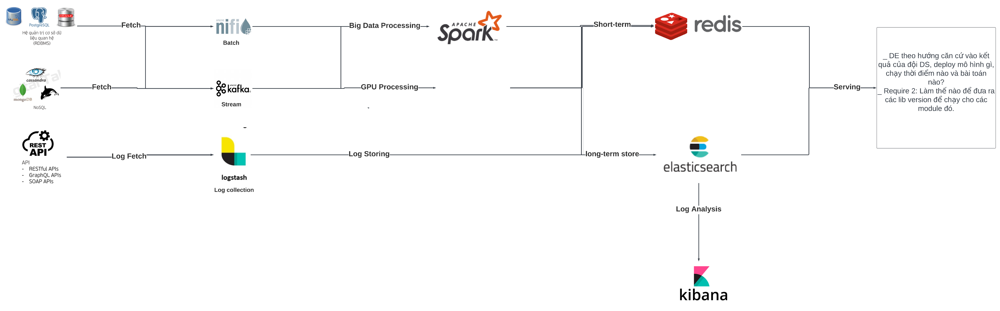

Redis with RAG: 
    https://github.com/langchain-ai/langchain/issues/9324
    https://redis.io/blog/using-redis-for-real-time-rag-goes-beyond-a-vector-database/
    https://redis.io/blog/announcing-langchain-rag-template-powered-by-redis/
https://github.com/redis/redis/issues/13396

mysql: 3307
mssql: 1433
postgresql: 5433
oracle:
mariadb:3308
mongodb:
redis:
elasticsearch:
